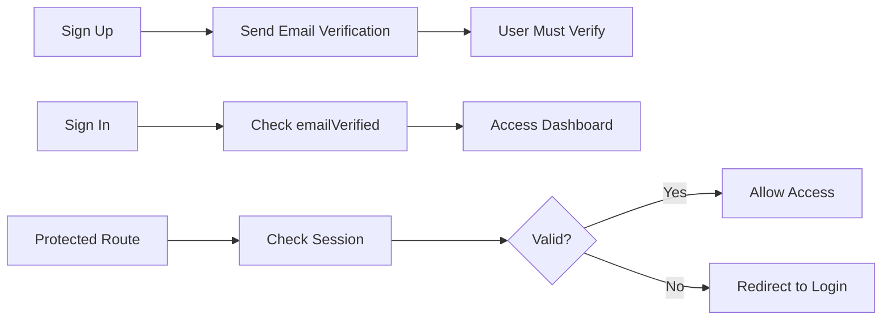

# Phase 2: Authentication Patterns

---

## Prompt 2A: Supabase Email/Password Auth

**Add to foundation when basic auth is needed**

---

### Requirements

- Sign Up: email + password → creates user, redirects to verification/onboarding
- Sign In: email + password → redirects to dashboard
- Sign Out: clear session, redirect to home
- Session: Use `supabase.auth.getSession()` and `onAuthStateChange()`
- Password reset: Send reset email with Supabase's built-in flow

---

### Error Messages (Exact)

```typescript
const ERROR_MESSAGES = {
  INVALID_CREDENTIALS: "Email or password is incorrect",
  USER_EXISTS: "An account with this email already exists",
  GENERIC: "Something went wrong. Please try again."
}
```

---

### Auth Flow



---

### Do Not

- ❌ Use Firebase
- ❌ Use browser prompts (alert/confirm)
- ❌ Redesign existing UI (only wire up logic)

---

### Output Deliverables

1. ✅ Auth utility functions (`lib/auth.ts`)
2. ✅ Login page component
3. ✅ Signup page component
4. ✅ Protected route wrapper (`ProtectedRoute.tsx`)
5. ✅ Session context/provider (`AuthContext.tsx`)

---

### Code Template: Auth Utilities

```typescript
// lib/auth.ts
import { supabase } from './supabase'

export const auth = {
  async signUp(email: string, password: string) {
    const { data, error } = await supabase.auth.signUp({
      email,
      password
    })

    if (error) {
      if (error.message.includes('already')) {
        throw new Error(ERROR_MESSAGES.USER_EXISTS)
      }
      throw new Error(ERROR_MESSAGES.GENERIC)
    }

    return data
  },

  async signIn(email: string, password: string) {
    const { data, error } = await supabase.auth.signInWithPassword({
      email,
      password
    })

    if (error) {
      throw new Error(ERROR_MESSAGES.INVALID_CREDENTIALS)
    }

    return data
  },

  async signOut() {
    await supabase.auth.signOut()
  },

  async resetPassword(email: string) {
    const { error } = await supabase.auth.resetPasswordForEmail(email, {
      redirectTo: `${window.location.origin}/auth/reset-password`
    })

    if (error) throw new Error(ERROR_MESSAGES.GENERIC)
  }
}
```

---

### Code Template: Protected Route

```typescript
// components/ProtectedRoute.tsx
import { useEffect, useState } from 'react'
import { Navigate } from 'react-router-dom'
import { supabase } from '../lib/supabase'

export function ProtectedRoute({ children }: { children: React.ReactNode }) {
  const [loading, setLoading] = useState(true)
  const [session, setSession] = useState(null)

  useEffect(() => {
    supabase.auth.getSession().then(({ data: { session } }) => {
      setSession(session)
      setLoading(false)
    })

    const { data: { subscription } } = supabase.auth.onAuthStateChange((_event, session) => {
      setSession(session)
    })

    return () => subscription.unsubscribe()
  }, [])

  if (loading) return <div>Loading...</div>
  if (!session) return <Navigate to="/login" />

  return <>{children}</>
}
```

---

## Prompt 2B: Add Google OAuth

**Add to existing email/password auth**

---

### Requirements

- Add "Sign in with Google" button to login/signup pages
- Use `supabase.auth.signInWithOAuth({ provider: 'google' })`
- Handle OAuth callback
- Sync Google profile data to user profile (display_name, avatar_url)
- Check if user exists, create profile if first time

---

### Redirects

```yaml
Successful login: /dashboard
Admin users: /admin
```

---

### Error Handling

```typescript
if (error) {
  return "Sign in with Google failed. Please try again."
}
```

---

### Output Deliverables

1. ✅ Updated login/signup pages with Google button
2. ✅ OAuth callback handler
3. ✅ Profile sync on first login

---

### Code Template: Google OAuth

```typescript
// lib/oauth.ts
import { supabase } from './supabase'

export async function signInWithGoogle() {
  const { data, error } = await supabase.auth.signInWithOAuth({
    provider: 'google',
    options: {
      redirectTo: `${window.location.origin}/auth/callback`,
      queryParams: {
        access_type: 'offline',
        prompt: 'consent',
      }
    }
  })

  if (error) throw new Error('Google sign in failed')
}

// Callback handler (in /auth/callback route)
import { useEffect } from 'react'
import { useNavigate } from 'react-router-dom'

export function AuthCallback() {
  const navigate = useNavigate()

  useEffect(() => {
    supabase.auth.onAuthStateChange((event, session) => {
      if (event === 'SIGNED_IN') {
        // Check if user profile exists, create if not
        syncUserProfile(session.user)
        navigate(session?.user?.user_metadata?.role === 'admin' ? '/admin' : '/dashboard')
      }
    })
  }, [navigate])

  return <div>Completing sign in...</div>
}

async function syncUserProfile(user: any) {
  const { data: existing } = await supabase
    .from('profiles')
    .select('id')
    .eq('id', user.id)
    .single()

  if (!existing) {
    await supabase.from('profiles').insert({
      id: user.id,
      display_name: user.user_metadata.full_name || user.email,
      avatar_url: user.user_metadata.avatar_url,
      role: 'user'
    })
  }
}
```

---

## Setup Checklist

- [ ] Enable Email Auth in Supabase dashboard
- [ ] Enable Google OAuth in Supabase dashboard
- [ ] Add Google OAuth redirect URL in Google Cloud Console
- [ ] Set up email templates (verification, reset)
- [ ] Configure RLS policies for user isolation

---

## Next Steps

After completing Phase 2:

1. → Implement [Phase 3A: User Dashboard](./03-data-dashboard-patterns.md)
2. → Add [Phase 4: Common Features](./04-common-features.md) if needed

---

*Part of the [Berlin Solopreneur SaaS Prompt Pack](../README.md)*
