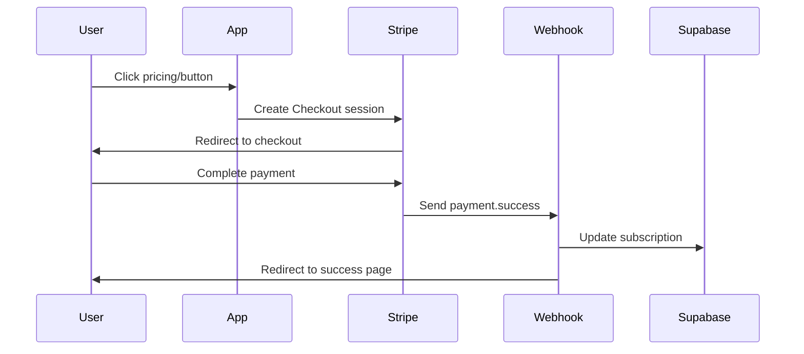

# Phase 4: Common Features

---

## Prompt 4A: Stripe Payments

**Add subscription or one-time payments**

---

### Requirements

- Use Stripe Checkout for payments
- Supabase Edge Function for payment processing
- Webhook handler for payment.success events
- Store payment records in payments table

---

### Payment Flow



---

### Database Schema

```sql
-- Payments table
CREATE TABLE payments (
  id UUID PRIMARY KEY DEFAULT gen_random_uuid(),
  user_id UUID REFERENCES auth.users(id) ON DELETE CASCADE,
  amount DECIMAL(10,2) NOT NULL,
  currency TEXT DEFAULT 'eur',
  status TEXT NOT NULL,
  stripe_payment_intent_id TEXT UNIQUE,
  created_at TIMESTAMPTZ DEFAULT NOW()
);

-- Subscriptions table
CREATE TABLE subscriptions (
  id UUID PRIMARY KEY DEFAULT gen_random_uuid(),
  user_id UUID REFERENCES auth.users(id) ON DELETE CASCADE UNIQUE,
  plan_id TEXT NOT NULL,
  status TEXT NOT NULL,
  current_period_end TIMESTAMPTZ,
  cancel_at_period_end BOOLEAN DEFAULT FALSE,
  created_at TIMESTAMPTZ DEFAULT NOW(),
  updated_at TIMESTAMPTZ DEFAULT NOW()
);

-- Enable RLS
ALTER TABLE payments ENABLE ROW LEVEL SECURITY;
ALTER TABLE subscriptions ENABLE ROW LEVEL SECURITY;

-- Users can only see their own payments/subscriptions
CREATE POLICY "Users can view own payments" ON payments
  FOR SELECT USING (auth.uid() = user_id);

CREATE POLICY "Users can view own subscriptions" ON subscriptions
  FOR SELECT USING (auth.uid() = user_id);
```

---

### Output Deliverables

1. ✅ Stripe checkout initiation
2. ✅ Supabase Edge Function for webhook
3. ✅ Payment success page
4. ✅ Subscription management page (cancel/update)

---

### Code Template: Checkout Initiation

```typescript
// lib/stripe.ts
import { supabase } from './supabase'

const STRIPE_PRICE_IDS = {
  basic: 'price_xxx',
  pro: 'price_yyy',
  enterprise: 'price_zzz'
}

export async function createCheckoutSession(priceId: string) {
  const { data: { user } } = await supabase.auth.getUser()

  const response = await fetch(
    `${import.meta.env.VITE_SUPABASE_URL}/functions/v1/create-checkout`,
    {
      method: 'POST',
      headers: {
        'Content-Type': 'application/json',
        'Authorization': `Bearer ${user?.access_token}`
      },
      body: JSON.stringify({ priceId })
    }
  )

  const { checkoutUrl, error } = await response.json()

  if (error) throw new Error(error)

  // Redirect to Stripe Checkout
  window.location.href = checkoutUrl
}
```

---

### Code Template: Edge Function (Webhook Handler)

```typescript
// supabase/functions/stripe-webhook/index.ts
import { serve } from 'https://deno.land/std@0.168.0/http/server.ts'
import { createClient } from 'https://esm.sh/@supabase/supabase-js@2'
import Stripe from 'https://esm.sh/stripe@14.21.0'

const stripe = new Stripe(Deno.env.get('STRIPE_SECRET_KEY')!)
const webhookSecret = Deno.env.get('STRIPE_WEBHOOK_SECRET')!
const supabase = createClient(
  Deno.env.get('SUPABASE_URL')!,
  Deno.env.get('SUPABASE_SERVICE_ROLE_KEY')!
)

serve(async (req) => {
  const signature = req.headers.get('Stripe-Signature')
  const body = await req.text()

  let event: Stripe.Event

  try {
    event = stripe.webhooks.constructEvent(body, signature, webhookSecret)
  } catch (err) {
    return new Response(err.message, { status: 400 })
  }

  switch (event.type) {
    case 'checkout.session.completed': {
      const session = event.data.object as Stripe.Checkout.Session
      const userId = session.metadata?.userId

      // Create subscription record
      await supabase.from('subscriptions').upsert({
        user_id: userId,
        plan_id: session.mode === 'subscription' ? 'pro' : 'basic',
        status: 'active',
        current_period_end: session.subscription
          ? new Date((session.subscription as any).current_period_end * 1000).toISOString()
          : null
      })

      // Log payment
      await supabase.from('payments').insert({
        user_id: userId,
        amount: session.amount_total! / 100,
        currency: session.currency,
        status: 'succeeded',
        stripe_payment_intent_id: session.payment_intent as string
      })

      break
    }

    case 'customer.subscription.deleted': {
      const subscription = event.data.object as Stripe.Subscription
      await supabase.from('subscriptions')
        .update({ status: 'canceled' })
        .eq('stripe_subscription_id', subscription.id)
      break
    }
  }

  return new Response(JSON.stringify({ received: true }), { status: 200 })
})
```

---

### Pricing Page Template

```typescript
// components/Pricing.tsx
export function Pricing() {
  const plans = [
    {
      name: 'Basic',
      price: '€9',
      interval: 'month',
      features: ['5 projects', 'Basic support', '1GB storage'],
      priceId: STRIPE_PRICE_IDS.basic
    },
    {
      name: 'Pro',
      price: '€29',
      interval: 'month',
      features: ['Unlimited projects', 'Priority support', '100GB storage', 'API access'],
      priceId: STRIPE_PRICE_IDS.pro,
      popular: true
    },
    {
      name: 'Enterprise',
      price: '€99',
      interval: 'month',
      features: ['Everything in Pro', 'Custom integrations', 'Dedicated support'],
      priceId: STRIPE_PRICE_IDS.enterprise
    }
  ]

  return (
    <div className="pricing">
      {plans.map(plan => (
        <div key={plan.name} className={`plan ${plan.popular ? 'popular' : ''}`}>
          <h3>{plan.name}</h3>
          <p className="price">{plan.price}<span>/{plan.interval}</span></p>
          <ul>
            {plan.features.map(feature => (
              <li key={feature}>{feature}</li>
            ))}
          </ul>
          <button onClick={() => createCheckoutSession(plan.priceId)}>
            Get Started
          </button>
        </div>
      ))}
    </div>
  )
}
```

---

## Prompt 4B: Real-time Features

**Add live updates using Supabase Realtime**

---

### Requirements

- Enable Realtime on [TABLE]
- Subscribe to changes for current user's data
- Update UI instantly when data changes
- Handle connection errors gracefully

---

### Subscription Pattern

```typescript
// Real-time subscription pattern
const channel = supabase
  .channel('custom-channel')
  .on('postgres_changes', {
    event: '*',
    schema: 'public',
    table: '[TABLE_NAME]',
    filter: 'user_id=eq.[CURRENT_USER_ID]'
  }, (payload) => {
    // Update UI with new data
    console.log('Change received:', payload)
  })
  .subscribe()

// Cleanup on unmount
return () => {
  supabase.removeChannel(channel)
}
```

---

### Use Cases

| Use Case | Implementation |
|----------|----------------|
| Live notifications | Subscribe to notifications table, show toast |
| Real-time order updates | Subscribe to orders table, update status |
| Collaborative editing | Subscribe to documents table, sync changes |
| Status changes | Subscribe to status field, update UI |

---

### Code Template: Notification System

```typescript
// hooks/useNotifications.ts
export function useNotifications() {
  const [notifications, setNotifications] = useState([])
  const { data: { user } } = useSession()

  useEffect(() => {
    if (!user) return

    // Load initial notifications
    loadNotifications()

    // Subscribe to new notifications
    const channel = supabase
      .channel('notifications')
      .on('postgres_changes', {
        event: 'INSERT',
        schema: 'public',
        table: 'notifications',
        filter: `user_id=eq.${user.id}`
      }, (payload) => {
        // Show toast notification
        toast.show(payload.new.message, { type: 'info' })

        // Add to list
        setNotifications(prev => [payload.new, ...prev])
      })
      .subscribe()

    return () => supabase.removeChannel(channel)
  }, [user])

  async function loadNotifications() {
    const { data } = await supabase
      .from('notifications')
      .select('*')
      .eq('user_id', user.id)
      .order('created_at', { ascending: false })
      .limit(50)

    setNotifications(data || [])
  }

  return { notifications }
}
```

---

### Connection Status Indicator

```typescript
// components/ConnectionStatus.tsx
export function ConnectionStatus() {
  const [status, setStatus] = useState('connected')

  useEffect(() => {
    const channel = supabase
      .channel('connection-status')
      .subscribe((status) => {
        setStatus(status)
      })

    return () => supabase.removeChannel(channel)
  }, [])

  return (
    <div className={`connection-indicator ${status}`}>
      <span className="dot" />
      {status === 'connected' ? 'Live' : 'Reconnecting...'}
    </div>
  )
}
```

---

### Output Deliverables

1. ✅ Realtime enabled on relevant tables
2. ✅ Subscription hooks in components
3. ✅ Notification system (if applicable)
4. ✅ Connection status indicator

---

## Setup Checklist

### Stripe Payments
- [ ] Create Stripe account and get API keys
- [ ] Create products and prices in Stripe dashboard
- [ ] Set up webhook endpoint in Supabase
- [ ] Configure webhook secret in environment variables
- [ ] Test checkout flow in test mode

### Real-time Features
- [ ] Enable Realtime on required tables in Supabase
- [ ] Implement subscription hooks
- [ ] Add connection status indicator
- [ ] Handle reconnection logic
- [ ] Test with multiple browser tabs

---

## Next Steps

After completing Phase 4:

1. → Add [Phase 8: WhatsApp & AI Integration](./08-whatsapp-ai-integration.md)
2. → Implement [Phase 9: Edge Functions](./09-edge-functions.md) for custom logic

---

*Part of the [Berlin Solopreneur SaaS Prompt Pack](../README.md)*
